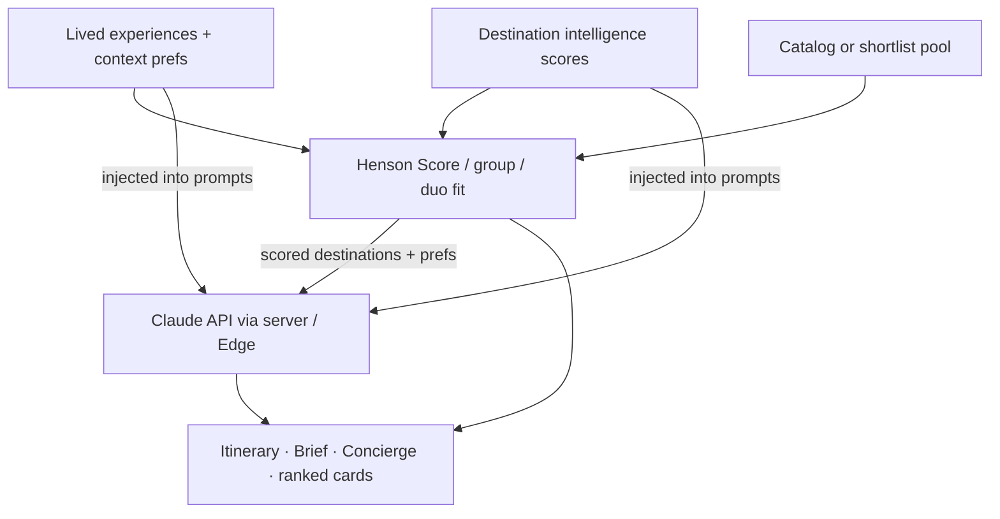
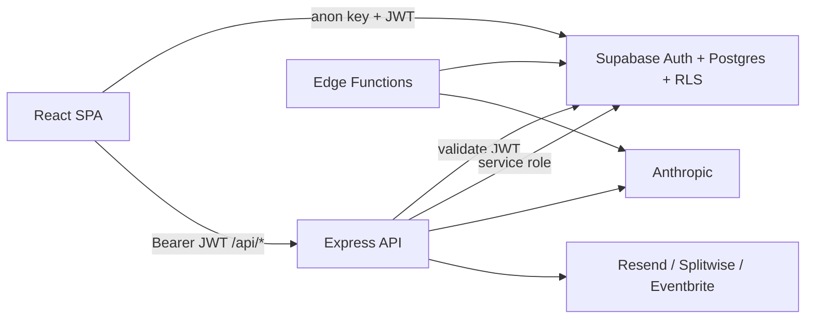

# Henson

Group travel platform that ranks and plans destinations for identity-aware crews. Lived-experience profiles and Henson Scores drive deterministic picks; Claude turns that structured intelligence into itineraries, briefs, and Concierge chat.

> **Source available on request — not open source.** This repository is a portfolio overview of a private codebase: architecture, design notes, and short illustrative excerpts. It does not contain runnable application code. See [LICENSE](LICENSE).

## Identity-aware recommendation layer

This is the core product loop. There is no embedding index or vector search: ranking is **structured and inspectable**, then Claude generates from that ground truth.

1. **Identity inputs.** Organizers and travelers set lived-experience tags and destination-context preferences (belonging, safety depth, world context, community voice). Those tags decide whether the UI shows contextual or baseline destination framing.
2. **Destination intelligence store.** Each catalog destination joins a `safety_knowledge` row: American traveler context, community safety, and cultural welcome (each 0–10), optional lived-experience data, geopolitical flags, and source citations. That row is the ranking authority, not freeform LLM memory.
3. **Deterministic ranking.** The Henson Score weights the three dimensions 35 / 35 / 30. Group ranking reweights when the trip includes a Black American lived-experience tag, then applies budget/region and advisory adjustments. Two-person trips add pace and budget fit on top. Shortlist mode limits the pool to three organizer-chosen options. See [docs/excerpts/scoring.md](docs/excerpts/scoring.md).
4. **Claude as the generative layer.** Server routes and Edge Functions call Anthropic with prompts that inject the trip profile, participant preferences, and destination intelligence. Claude does not invent the score; it writes itineraries, Trip Briefs, destination-feed copy, and Concierge replies **conditioned on** that scored context. See [docs/excerpts/prompt-design.md](docs/excerpts/prompt-design.md).
5. **Scope gate.** Domestic trips hide score surfaces, advisories, and full-catalog discovery so coordination isn't drowned by intel the group doesn't need.

## Architecture

A React SPA (Vite) uses **Supabase** for auth, Postgres, row-level security, and storage. Privileged work (AI calls, OAuth, webhooks, signed public links) goes through an **Express** API. Edge Functions handle invites, digests, and some chat. Resend, Splitwise, and Eventbrite attach outboard.

## Stack

React 19 · Vite · Tailwind 4 · React Router · Supabase · Express 5 · Vitest · Anthropic SDK · jsPDF

## Design principles

- **Scores before prose.** Ranking is plain, testable code over stored scores; Claude only sees what those tables and preferences already assert.
- **Three trust surfaces.** Organizer workspace, participant portal (share-token links), and agency console. Decision and interest links use HMAC-signed tokens, not session cookies.
- **Postgres authority; server privilege.** Roster and intelligence live under row-level security; the service role is reserved for rate limits, OAuth tokens, webhooks, and feed jobs.
- **AI never browser-keyed.** Anthropic is called only from the server or Edge Functions, after JWT auth, payload validation, and rate limits.
- **Integrations stay outboard.** Splitwise and Eventbrite OAuth live on the server; trip rows hold only foreign IDs.

## Demo and source access

Demo video: _coming soon_.

The application source is private. If you're evaluating my work and would like a walkthrough or read access, please reach out through my GitHub profile.
